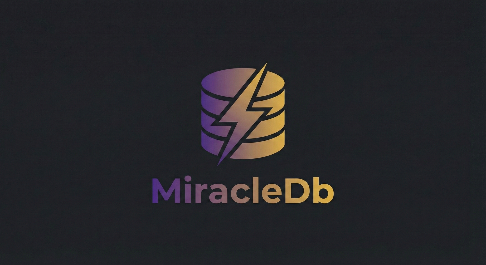

<p align="center">
  
</p>

<h1 align="center">MiracleDb</h1>

<p align="center">
  A high-performance, multi-model database engine built in Rust
</p>

<p align="center">
  
  
  
  
</p>

---

## What is MiracleDb?

MiracleDb is a next-generation database engine that combines **relational SQL**, **vector search**, **full-text search**, **time series**, **geospatial**, **graph**, and **ML inference** into a single unified system — all written in Rust.

| Engine | Purpose |
|--------|---------|
| [DataFusion](https://github.com/apache/arrow-datafusion) | SQL query execution |
| [Lance](https://github.com/lancedb/lance) | Vector storage & ANN indexing |
| [Tantivy](https://github.com/quickwit-oss/tantivy) | Full-text search |
| [Wasmer](https://wasmer.io) | WASM user-defined functions |
| [Candle](https://github.com/huggingface/candle) | Rust-native ML inference |

---

## Features

- **SQL** — Full SELECT / INSERT / UPDATE / DELETE with transactions
- **Vector Search** — Embeddings + IVF-PQ approximate nearest neighbor
- **Full-Text Search** — BM25, phrase queries, wildcard, bulk indexing
- **Geospatial** — R-tree index, ST_Distance, ST_Contains, nearest-neighbor
- **Time Series** — Downsample, gap-fill, lag/lead, moving average
- **ML / UDFs** — WASM UDFs, ONNX inference, Candle ML models
- **HTAP** — Dual-store routing (OLTP row store + OLAP column store)
- **CDC** — Change Data Capture with PostgreSQL logical replication
- **Security** — PQC tokens, RBAC, column encryption, data masking
- **Backup** — zstd-compressed snapshots, cron scheduler, Shamir secret sharing
- **Observability** — Prometheus metrics, OpenTelemetry tracing, health checks
- **Embedded Mode** — Run in-process, no server required
- **Graph** — Node/edge storage with traversal
- **NLP** — Tokenization, sentiment analysis, Text-to-SQL
- **Blockchain Audit** — Tamper-evident log with Merkle proofs

---

## Quick Start

### Linux
```bash
tar -xzf miracledb-linux-x86_64.tar.gz
cd miracledb-linux-x86_64
./miracledb --config miracledb.toml
```

### Windows
Extract the zip and run `miracledb.exe`.

### Embedded (Rust)
```rust
use miracledb::embedded::EmbeddedDb;

let db = EmbeddedDb::new();
db.execute("CREATE TABLE users (id INT, name TEXT)").await?;
db.execute("INSERT INTO users VALUES (1, 'Alice')").await?;
let rows = db.query("SELECT * FROM users WHERE id = 1").await?;
```

---

## Build from Source

```bash
git clone https://github.com/ssameerr/MiracleDb.git
cd MiracleDb/miracledb
cargo build --release
cargo test --lib   # 308 tests
```

---

## Roadmap

See [ROADMAP.md](ROADMAP.md) for the full feature breakdown with completion percentages across 35 categories.

**Overall completion: ~68%**

---

## License

MIT
